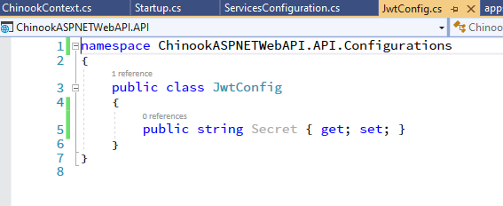

# Identity in your Web API

## START FROM PREVIOUS MODULE'S END
[Caching Data in Your API](caching-data.md)

## INSTALL NUGET PACKAGES TO API PROJECT

```dos
dotnet add package Microsoft.AspNetCore.Authentication.JwtBearer 
dotnet add package Microsoft.AspNetCore.Identity.EntityFrameworkCore 
dotnet add package Microsoft.AspNetCore.Identity.UI
```

## INSTALL NUGET PACKAGE TO DATA PROJECT

```dos
dotnet add package Microsoft.AspNetCore.Identity.EntityFrameworkCore
```

## RESTORE UPDATED CHINOOK DB OR ADD IDENTITY TABLES TO EXISTING DB

You can either restore a new database using a BAK file (if using MSSQL 2019) or run a SQL script if using older version of MSSQL.

### RESTORING UPDATED CHINOOK DB WITH BAK FILE
Download the <a href="https://github.com/cwoodruff/aspnet-5-web-api-workshop/blob/main/module-1/01-09%20Identity%20in%20your%20Web%20API/database/ChinookWithIdentity.bak" target="_blank">Chinook database BAK file</a> for this part of the workshop in the GitHub repo. The file is a backup so we will restore it to where you have MSSQL 2019 installed.

### RUN SQL SCRIPT TO ADD IDENTITY TABLES TO EXISTING CHINOOK DB
If you don't have MSSQL 2019 installed you can update your Chinook database by running this <a href="https://github.com/cwoodruff/aspnet-5-web-api-workshop/blob/main/module-1/01-09%20Identity%20in%20your%20Web%20API/database/ChinookWithIdentity.sql" target="_blank">SQL script</a> against your database to add the tables needed for Identity for this part of the workshop.

## UPDATE OUR APPSETTINGS.JSON IN API PROJECT
**Note:** Will need to <a href="https://www.random.org/strings/" target="_blank">generate</a> your new 32 character string. 

```json
"JwtConfig": {
    "Secret" : "jkbflfzogupbyhypamekltpwkumodlfa"
  },
** Note: https://www.random.org/string
```


## CREATE NEW CLASS IN CONFIGURATION FOLDER IN API PROJECT

```csharp
namespace ChinookASPNETWebAPI.API.Configurations
{
    public class JwtConfig
    {
        public string Secret { get; set; }
    }
}
```
 
 
 
## ADD IDENTITY AND JWT CODE TO STARTUP IN API PROJECT

### ServicesConfiguration.cs
```csharp
public static void AddIdentity(this IServiceCollection services,
    IConfiguration configuration)
{
    services.Configure<JwtConfig>(configuration.GetSection("JwtConfig"));

    services.AddAuthentication(options => {
            options.DefaultAuthenticateScheme = JwtBearerDefaults.AuthenticationScheme;
            options.DefaultScheme = JwtBearerDefaults.AuthenticationScheme;
            options.DefaultChallengeScheme = JwtBearerDefaults.AuthenticationScheme;
        })
        .AddJwtBearer(jwt => {
            var key = Encoding.ASCII.GetBytes(configuration["JwtConfig:Secret"]);

            jwt.SaveToken = true;
            jwt.TokenValidationParameters = new TokenValidationParameters{
                ValidateIssuerSigningKey= true,
                IssuerSigningKey = new SymmetricSecurityKey(key),
                ValidateIssuer = false, 
                ValidateAudience = false,
                RequireExpirationTime = false,
                ValidateLifetime = true
            }; 
        });

    services.AddDefaultIdentity<IdentityUser>(options => options.SignIn.RequireConfirmedAccount = true)
        .AddEntityFrameworkStores<ChinookContext>();
}
```

## ADD TO STARTUP CONFIGURE IN API PROJECT

```csharp
app.UseAuthentication();
```


**Note**: Add to very first line and has to be before app.UseAuthorization();

## ADD NEW CLASSES FOR IDENTITY IN IDENTITY FOLDER IN DOMAIN PROJECT

### AuthResult.cs

```csharp
using System.Collections.Generic;

namespace ChinookASPNETWebAPI.Domain.Identity
{
    public class AuthResult
    {
        public string Token {get;set;}
        public bool Result { get; set; }
        public List<string> Errors { get; set; }
    }
}
```

### RegisterModel.cs
```csharp
using System.ComponentModel.DataAnnotations;

namespace ChinookASPNETWebAPI.Domain.Identity
{
    public class RegisterModel
    {
        [Required]
        public string Name { get; set; }
        [Required]
        public string Email { get; set; }
        [Required]
        public string Password { get; set; }
    }
}
```

### RegistrationResponse.cs
```csharp
namespace ChinookASPNETWebAPI.Domain.Identity
{
    public class RegistrationResponse : AuthResult
    {

    }
}
```

### LoginModel.cs
```csharp
using System.ComponentModel.DataAnnotations;

namespace ChinookASPNETWebAPI.Domain.Identity
{
    public class LoginModel
    {
        [Required]
        public string Email { get; set; }
        [Required]
        public string Password { get; set; }
    }
}
```

## UPDATE DBCONTEXT TO DESCEND FROM IDENTITYDBCONTEXT


## ADD REGISTER ACTION AND LOGIN ACTION TO HOME CONTROLLER IN API POJECT
```csharp
[Route("api/[controller]")]
[ApiController]
[EnableCors("CorsPolicy")]
[ApiVersion( "1.0" )]
public class HomeController : ControllerBase
{
    private readonly ILogger<HomeController> _logger;
    private readonly UserManager<IdentityUser> _userManager;
    private readonly JwtConfig _jwtConfig;

    public HomeController(ILogger<HomeController> logger, UserManager<IdentityUser> userManager,
        IOptionsMonitor<JwtConfig> optionsMonitor)
    {
        _logger = logger;
        _userManager = userManager;
        _jwtConfig = optionsMonitor.CurrentValue;
    }

    [HttpGet]
    public IActionResult Index()
    {
        return Ok();
    }

    [HttpPost, Route("Register")]
    public async Task<ActionResult<RegistrationResponse>> Register([FromBody] RegisterModel user)
    {
        // Check if the incoming request is valid
        if (ModelState.IsValid)
        {
            // check i the user with the same email exist
            var existingUser = await _userManager.FindByEmailAsync(user.Email);

            if (existingUser != null)
                return BadRequest(new RegistrationResponse
                {
                    Result = false,
                    Errors = new List<string>
                    {
                        "Email already exist"
                    }
                });

            var newUser = new IdentityUser { Email = user.Email, UserName = user.Email };
            var isCreated = await _userManager.CreateAsync(newUser, user.Password);
            if (isCreated.Succeeded)
            {
                var jwtToken = GenerateJwtToken(newUser);

                return Ok(new RegistrationResponse
                {
                    Result = true,
                    Token = jwtToken
                });
            }

            return new JsonResult(new RegistrationResponse
                {
                    Result = false,
                    Errors = isCreated.Errors.Select(x => x.Description).ToList()
                }
            ) { StatusCode = 500 };
        }

        return BadRequest(new RegistrationResponse
        {
            Result = false,
            Errors = new List<string>
            {
                "Invalid payload"
            }
        });
    }

    [HttpPost, Route("Login")]
    public async Task<ActionResult<RegistrationResponse>> Login([FromBody] LoginModel user)
    {
        if(ModelState.IsValid)
        {
            // check if the user with the same email exist
            var existingUser = await _userManager.FindByEmailAsync(user.Email);

            if(existingUser == null) 
            {
                // We dont want to give to much information on why the request has failed for security reasons
                return BadRequest(new RegistrationResponse() {
                    Result = false,
                    Errors = new List<string>(){
                        "Invalid authentication request"
                    }});
            }

            // Now we need to check if the user has inputed the right password
            var isCorrect = await _userManager.CheckPasswordAsync(existingUser, user.Password);

            if(isCorrect)
            {
                var jwtToken = GenerateJwtToken(existingUser);

                return Ok(new RegistrationResponse() {
                    Result = true, 
                    Token = jwtToken
                });
            }
            else 
            {
                // We dont want to give to much information on why the request has failed for security reasons
                return BadRequest(new RegistrationResponse() {
                    Result = false,
                    Errors = new List<string>(){
                        "Invalid authentication request"
                    }});
            }
        }

        return BadRequest(new RegistrationResponse() {
            Result = false,
            Errors = new List<string>(){
                "Invalid payload"
            }});
    }

    private string GenerateJwtToken(IdentityUser user)
    {
        // Now its ime to define the jwt token which will be responsible of creating our tokens
        var jwtTokenHandler = new JwtSecurityTokenHandler();

        // We get our secret from the appsettings
        var key = Encoding.ASCII.GetBytes(_jwtConfig.Secret);

        // we define our token descriptor
        // We need to utilise claims which are properties in our token which gives information about the token
        // which belong to the specific user who it belongs to
        // so it could contain their id, name, email the good part is that these information
        // are generated by our server and identity framework which is valid and trusted
        var tokenDescriptor = new SecurityTokenDescriptor
        {
            Subject = new ClaimsIdentity(new[]
            {
                new Claim("Id", user.Id),
                new Claim(JwtRegisteredClaimNames.Sub, user.Email),
                new Claim(JwtRegisteredClaimNames.Email, user.Email),
                // the JTI is used for our refresh token which we will be convering in the next video
                new Claim(JwtRegisteredClaimNames.Jti, Guid.NewGuid().ToString())
            }),
            // the life span of the token needs to be shorter and utilise refresh token to keep the user signedin
            // but since this is a demo app we can extend it to fit our current need
            Expires = DateTime.UtcNow.AddHours(6),
            // here we are adding the encryption alogorithim information which will be used to decrypt our token
            SigningCredentials = new SigningCredentials(new SymmetricSecurityKey(key),
                SecurityAlgorithms.HmacSha512Signature)
        };

        var token = jwtTokenHandler.CreateToken(tokenDescriptor);

        var jwtToken = jwtTokenHandler.WriteToken(token);

        return jwtToken;
    }
}
```

## AUTHORIZE THE ALBUM CONTROLLER FOR IDENTITY IN API POJECT


## TEST IN POSTMAN

### Payload for Register Endpoint
```json
{
  "name": "Chris Woodruff",
  "email": "cwoodruff@live.com",
  "password": "p@ssw0rd"
}
```

### Login endpoint in Postman


### Results from Album GetAll Endpoint using Identity
