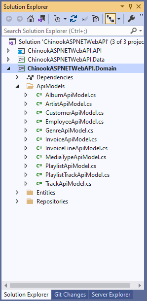
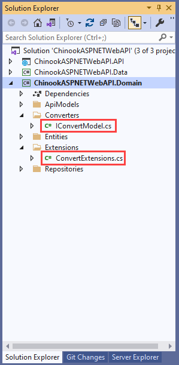
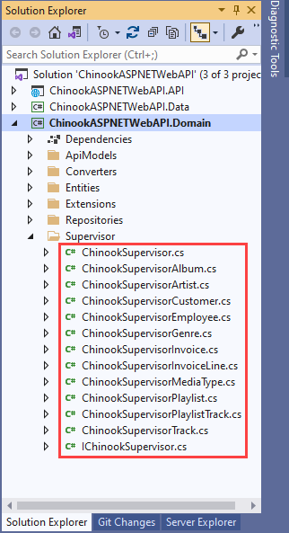
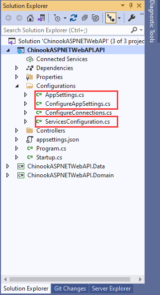
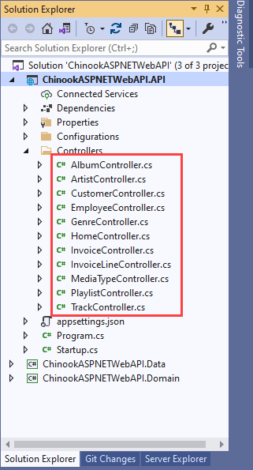

# Developing the API endpoints

## START FROM PREVIOUS MODULE'S END
[Developing the API Data access](ntier-data-access.md)

## ADD APIMODELS TO DOMAIN



```csharp
using System.Collections.Generic;

namespace ChinookASPNETWebAPI.Domain.ApiModels
{
    public class AlbumApiModel
    {
        public int Id { get; set; }
        public string Title { get; set; }
        public int ArtistId { get; set; }
        public string ArtistName { get; set; }

        public ArtistApiModel Artist { get; set; }

        public IList<TrackApiModel> Tracks { get; set; }
    }
}
```


## ADD IConvertModel TO DOMAIN



```csharp
using System.Threading.Tasks;

namespace ChinookASPNETWebAPI.Domain.Converters
{
    public interface IConvertModel<TSource, TTarget>
    {
        TTarget Convert();
    }
}
```


## ADD ConvertExtensions TO DOMAIN

```csharp
using System.Collections.Generic;
using System.Linq;
using System.Threading.Tasks;
using ChinookASPNETWebAPI.Domain.Converters;

namespace ChinookASPNETWebAPI.Domain.Extensions
{
    public static class ConvertExtensions
    {
        public static IEnumerable<TTarget> ConvertAll<TSource, TTarget>(
            this IEnumerable<IConvertModel<TSource, TTarget>> values)
            => values.Select(value => value.Convert());
    }
}
```


## ADD CONVERT CODE APIMODELS IN DOMAIN

```csharp
using System.Collections.Generic;
using System.Threading.Tasks;
using ChinookASPNETWebAPI.Domain.Converters;
using ChinookASPNETWebAPI.Domain.Entities;

namespace ChinookASPNETWebAPI.Domain.ApiModels
{
    public class AlbumApiModel : IConvertModel<AlbumApiModel, Album>
    {
        public int Id { get; set; }
        public string Title { get; set; }
        public int ArtistId { get; set; }
        public string ArtistName { get; set; }

        public ArtistApiModel Artist { get; set; }

        public IList<TrackApiModel> Tracks { get; set; }

        public Album Convert() =>
            new()
            {
                Id = Id,
                ArtistId = ArtistId,
                Title = Title ?? string.Empty
            };
    }
}
```


## ADD CONVERT CODE ENTITIES IN DOMAIN

```csharp
using System.Collections.Generic;
using ChinookASPNETWebAPI.Domain.ApiModels;
using ChinookASPNETWebAPI.Domain.Converters;

#nullable disable

namespace ChinookASPNETWebAPI.Domain.Entities
{
    public partial class Album : IConvertModel<Album, AlbumApiModel>
    {
        public Album()
        {
            Tracks = new HashSet<Track>();
        }

        public int Id { get; set; }
        public string Title { get; set; }
        public int ArtistId { get; set; }

        public virtual Artist Artist { get; set; }
        public virtual ICollection<Track> Tracks { get; set; }

        public AlbumApiModel Convert() =>
            new()
            {
                Id = Id,
                ArtistId = ArtistId,
                Title = Title
            };
    }
}
```

## ADD SUPERVISOR TO DOMAIN



Take a look at the <a href="https://github.com/cwoodruff/aspnet-5-web-api-workshop/tree/main/module-1/01-06%20Developing%20the%20API%20Endpoints/end/ChinookASPNETWebAPI.Domain/Supervisor" target="_blank">code here</a> for the logic of the Supervisor

## ADD APPSETTINGS TO  API PROJECT 



### appsettings.json
```json
{
  "Logging": {
    "LogLevel": {
      "Default": "Information",
      "Microsoft": "Warning",
      "Microsoft.Hosting.Lifetime": "Information"
    }
  },
  "ConnectionStrings": {
    "ChinookDbWindows": "Server=.;Database=Chinook;Trusted_Connection=True;Application Name=ChinookASPNETCoreAPINTier",
    "ChinookDbDocker": "Server=localhost,1433;Database=Chinook;User=sa;Password=P@55w0rd;Trusted_Connection=False;Application Name=ChinookASPNETCoreAPINTier"
  },
  "AllowedHosts": "*"
}
```
### AppSettings.cs

```csharp
namespace ChinookASPNETWebAPI.API.Configurations
{
    public abstract class AppSettings
    {
    }
}
```

### ConfigureAppSettings.cs

```csharp
using Microsoft.Extensions.Configuration;
using Microsoft.Extensions.DependencyInjection;

namespace ChinookASPNETWebAPI.API.Configurations
{
    public static class ConfigureAppSettings
    {
        public static IServiceCollection AddAppSettings(this IServiceCollection services, IConfiguration configuration)
        {
            services.Configure<AppSettings>(_ => configuration.GetSection("AppSettings").Bind(_));

            return services;
        }
    }
}
```

## ADD SERVICESCONFIGURATION TO API PROJECT

```csharp
public static class ServicesConfiguration
{
    public static void ConfigureRepositories(this IServiceCollection services)
    {
        services.AddScoped<IAlbumRepository, AlbumRepository>()
            .AddScoped<IArtistRepository, ArtistRepository>()
            .AddScoped<ICustomerRepository, CustomerRepository>()
            .AddScoped<IEmployeeRepository, EmployeeRepository>()
            .AddScoped<IGenreRepository, GenreRepository>()
            .AddScoped<IInvoiceRepository, InvoiceRepository>()
            .AddScoped<IInvoiceLineRepository, InvoiceLineRepository>()
            .AddScoped<IMediaTypeRepository, MediaTypeRepository>()
            .AddScoped<IPlaylistRepository, PlaylistRepository>()
            .AddScoped<ITrackRepository, TrackRepository>();
    }

    public static void ConfigureSupervisor(this IServiceCollection services)
    {
        services.AddScoped<IChinookSupervisor, ChinookSupervisor>();
    }
}
```

## ADD ConfigureRepositories() AND ConfigureSupervisor() TO CONFIGURESERVICES IN API PROJECT

```csharp
public void ConfigureServices(IServiceCollection services)
        {
            services.AddConnectionProvider(Configuration);
            services.AddAppSettings(Configuration);
            services.ConfigureRepositories();
            services.ConfigureSupervisor();
            services.AddControllers();
        }
```


## ADD CONTROLLERS TO API 



## ADD ACTIONS TO CONTROLLERS

```csharp
[Route("api/[controller]")]
[ApiController]
public class AlbumController : ControllerBase
{
    private readonly IChinookSupervisor _chinookSupervisor;
    private readonly ILogger<AlbumController> _logger;

    public AlbumController(IChinookSupervisor chinookSupervisor, ILogger<AlbumController> logger)
    {
        _chinookSupervisor = chinookSupervisor;
        _logger = logger;
    }

    [HttpGet]
    [Produces(typeof(List<AlbumApiModel>))]
    public async Task<ActionResult<List<AlbumApiModel>>> Get()
    {
        return Ok(await _chinookSupervisor.GetAllAlbum());
    }

    [HttpGet("{id}", Name = "GetAlbumById")]
    public async Task<ActionResult<AlbumApiModel>> Get(int id)
    {

        return Ok(await _chinookSupervisor.GetAlbumById(id));
    }

    [HttpGet("artist/{id}", Name = "GetByArtistId")]
    public async Task<ActionResult<List<AlbumApiModel>>> GetByArtistId(int id)
    {
        return Ok(await _chinookSupervisor.GetAlbumByArtistId(id));
    }

    [HttpPost]
    [Produces("application/json")]
    [Consumes("application/json")]
    public async Task<ActionResult<AlbumApiModel>> Post([FromBody] AlbumApiModel input)
    {

        return Ok(await _chinookSupervisor.AddAlbum(input));
    }

    [HttpPut("{id}")]
    [Produces("application/json")]
    [Consumes("application/json")]
    public async Task<ActionResult<AlbumApiModel>> Put(int id, [FromBody] AlbumApiModel input)
    {
        return Ok(await _chinookSupervisor.UpdateAlbum(input));
    }

    [HttpDelete("{id}")]
    public async Task<ActionResult> Delete(int id)
    {
        return Ok(await _chinookSupervisor.DeleteAlbum(id));
    }
}
```

## ADD LOGGING TO API PROJECT

```csharp
public static void AddAPILogging(this IServiceCollection services)
{
    services.AddLogging(builder => builder
        .AddConsole()
        .AddFilter(level => level >= LogLevel.Information)
    );
}
```

## ADD ConfigureRepositories() AND ConfigureSupervisor() TO CONFIGURESERVICES IN API PROJECT

```csharp
public void ConfigureServices(IServiceCollection services)
        {
            services.AddConnectionProvider(Configuration);
            services.AddAppSettings(Configuration);
            services.ConfigureRepositories();
            services.ConfigureSupervisor();
            services.ConfigureValidators();
            services.AddAPILogging();
            services.AddControllers().AddNewtonsoftJson();
        }
```


