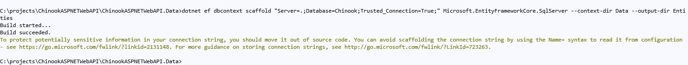

# Developing the API Data access

## START FROM PREVIOUS MODULE"S END
[Designing the NTier API](ntier-api-endpoints.md)

## ADD PROJECT REFERENCE FOR API PROJECT


## ADD PROJECT REFERENCE FOR DATA PROJECT


## INSTALL OR UPDATE THR EF CORE CLI

```dos
dotnet tool install --global dotnet-ef
dotnet tool update --global dotnet-ef
```


## ADD NUGET PACKAGES TO DATA PROJECT

```dos
dotnet add package Microsoft.EntityFrameworkCore.SqlServer
dotnet add package Microsoft.EntityFrameworkCore.Design
```


## SCAFFOLD DBCONTEXT AND ENTITIES FROM CHINOOK DATABASE

Run the following command in Developer Command Prompt

```dos
dotnet ef dbcontext scaffold "Server=.;Database=Chinook;Trusted_Connection=True;" Microsoft.EntityFrameworkCore.SqlServer --context-dir Data --output-dir Entities
```





## MOVE ENTITIES IN DATA PROJECT TO DOMAIN


Adjust the namespace for the Entities


Add using reference in DBContext to Entities in Domain


## ADD REPOSITORY INTERFACES TO DOMAIN


```csharp
using System;
using System.Collections.Generic;
using System.Threading.Tasks;
using ChinookASPNETWebAPI.Domain.Entities;

namespace ChinookASPNETWebAPI.Domain.Repositories
{
    public interface IAlbumRepository : IDisposable
    {
        Task<List<Album>> GetAll();
        Task<Album> GetById(int? id);
        Task<List<Album>> GetByArtistId(int id);
        Task<Album> Add(Album newAlbum);
        Task<bool> Update(Album album);
        Task<bool> Delete(int id);
    }
}
```


## ADD REPOSITORIES TO DATA


```csharp
using System.Collections.Generic;
using System.Linq;
using System.Threading.Tasks;
using ChinookASPNETWebAPI.Data.Data;
using ChinookASPNETWebAPI.Domain.Entities;
using ChinookASPNETWebAPI.Domain.Repositories;
using Microsoft.EntityFrameworkCore;

namespace ChinookASPNETWebAPI.Data.Repositories
{
    public class AlbumRepository : IAlbumRepository
    {
        private readonly ChinookContext _context;

        public AlbumRepository(ChinookContext context)
        {
            _context = context;
        }

        private async Task<bool> AlbumExists(int id) =>
            await _context.Albums.AnyAsync(a => a.Id == id);

        public void Dispose() => _context.Dispose();

        public async Task<List<Album>> GetAll() => await _context.Albums.AsNoTrackingWithIdentityResolution().ToListAsync();

        public async Task<Album> GetById(int? id)
        {
            var dbAlbum = await _context.Albums.FindAsync(id);
            return dbAlbum;
        }

        public async Task<Album> Add(Album newAlbum)
        {
            await _context.Albums.AddAsync(newAlbum);
            await _context.SaveChangesAsync();
            return newAlbum;
        }

        public async Task<bool> Update(Album album)
        {
            if (!await AlbumExists(album.Id))
                return false;
            _context.Albums.Update(album);
            await _context.SaveChangesAsync();
            return true;
        }

        public async Task<bool> Delete(int id)
        {
            if (!await AlbumExists(id))
                return false;
            var toRemove = await _context.Albums.FindAsync(id);
            _context.Albums.Remove(toRemove);
            await _context.SaveChangesAsync();
            return true;
        }

        public async Task<List<Album>> GetByArtistId(int id) =>
            await _context.Albums.Where(a => a.ArtistId == id).AsNoTrackingWithIdentityResolution().ToListAsync();
    }
}
```
## ADD DBCONTEXT TO DEPENDANCY INJECTION IN API PROJECT


```csharp
public static IServiceCollection AddConnectionProvider(this IServiceCollection services,
    IConfiguration configuration)
{
    var connection = String.Empty;

    if (RuntimeInformation.IsOSPlatform(OSPlatform.Windows))
    {
        connection = configuration.GetConnectionString("ChinookDbWindows") ??
                     "Server=.;Database=Chinook;Trusted_Connection=True;Application Name=ChinookASPNETCoreAPINTier";
    }
    else if (RuntimeInformation.IsOSPlatform(OSPlatform.Linux) ||
             RuntimeInformation.IsOSPlatform(OSPlatform.OSX))
    {
        connection = configuration.GetConnectionString("ChinookDbDocker") ??
                     "Server=localhost,1433;Database=Chinook;User=sa;Password=P@55w0rd;Trusted_Connection=False;Application Name=ChinookASPNETCoreAPINTier";
    }

    services.AddDbContextPool<ChinookContext>(options => options.UseSqlServer(connection));

    return services;
}
```

## CALL ADDCONNECTIONPROVIDER() IN CONFIGURESERVICES IN API PROJECT'S StartUP

```csharp
services.AddConnectionProvider(Configuration);
```


## REMOVE ONCONFIGURING() FROM DBCONTEXT


## REMOVE THE DBCONTEXT CONSTRUCTOR W/O A PARAMETER
