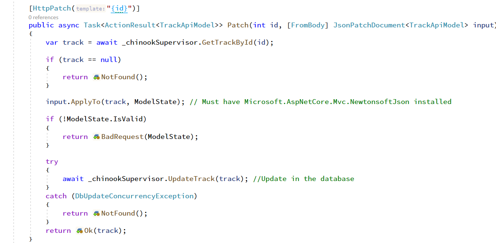

# Using the PATCH HTTP Request in your API

## START FROM PREVIOUS MODULE'S END
[Formatting Response Data in your API](formatting-response-data.md)

## ADD NEWTONSOFTJSON NUGET PACKAGES TO API PROJECT

```dos
dotnet add package Microsoft.AspNetCore.Mvc.NewtonsoftJson
```

## ADD PATCH ACTION TO TRACK CONTROLLER

```csharp
[HttpPatch("{id}")]  
public async Task<ActionResult<TrackApiModel>> Patch(int id, [FromBody] JsonPatchDocument<TrackApiModel> input)  
{  
	var track = await _chinookSupervisor.GetTrackById(id);  

	if (track == null)  
	{  
		return NotFound();  
	}  

	input.ApplyTo(track, ModelState); // Must have Microsoft.AspNetCore.Mvc.NewtonsoftJson installed  

	if (!ModelState.IsValid)  
	{  
		return BadRequest(ModelState);  
	}

	try  
	{  
		await _chinookSupervisor.UpdateTrack(track); //Update in the database
	}  
	catch (DbUpdateConcurrencyException)  
	{  
		return NotFound(); 
	}  
	return Ok(track);  
}
```


## TEST PATCH ADD OPERATION

For Id = 41
```json
{  
	"value": "Hand In My Pocket (Live)",  
	"path": "/Name",  
	"op": "add"  
}
```

## TEST PATCH REMOVE OPERATION

For Id = 41
```json
{  
	"path": "/Name",  
	"op": "remove"  
}
```

## TEST PATCH REPLACE OPERATION

For Id = 41
```json
{  
	"value": "221599",  
	"path": "/Milliseconds",  
	"op": "replace"  
} 
```