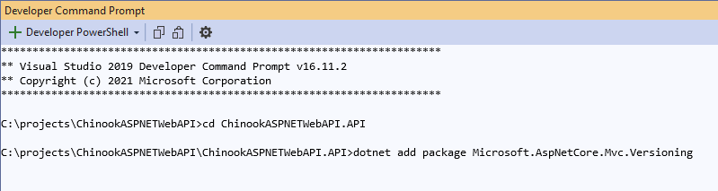
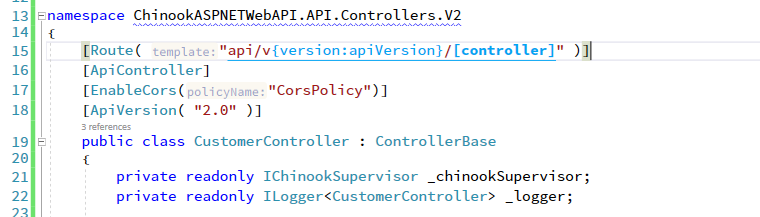
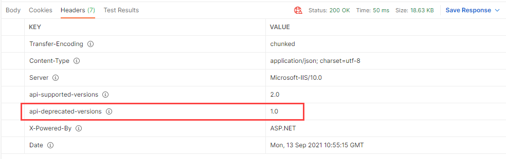

# Versioning your Web API

## START FROM PREVIOUS MODULE'S END
[Identity in your Web API]](identity.md)

## ADD VERSIONING NUGET PACKAGE TO API PROJECT

```dos
dotnet add package Microsoft.AspNetCore.Mvc.Versioning
```


## ADD API VERSIONING TO STARTUP CONFIGURESERVICES IN API PROJECT

```csharp
services.AddApiVersioning();
```

## ADD VERSIONING TO STARTUP IN API PROJECT

### ServicesConfiguration.cs

```csharp
services.AddApiVersioning(options =>
{
	options.AssumeDefaultVersionWhenUnspecified = true;
	options.DefaultApiVersion = new ApiVersion(1, 0);
	//options.DefaultApiVersion = new ApiVersion( new DateTime( 2020, 9, 22 ) );
	//options.DefaultApiVersion =
	//  new ApiVersion(new DateTime( 2020, 9, 22 ), "LetoII", 1, "Beta");
	options.ReportApiVersions = true;
	//options.ApiVersionReader = new HeaderApiVersionReader("api-version");
});
```

## MODIFY CONTROLLER FOR VERSIONING IN API PROJECT

```csharp
[Route( "api/v{version:apiVersion}/[controller]" )]
[ApiController]
[EnableCors("CorsPolicy")]
[ApiVersion( "1.0", Deprecated = true)]
public class CustomerController : ControllerBase
```


## TEST IN POSTMAN

### Version 1 Endpoint
```dos
https://localhost:44320/api/v1/Customer
```




### Version 2 Endpoint
```dos
https://localhost:44320/api/v2/Customer
```


