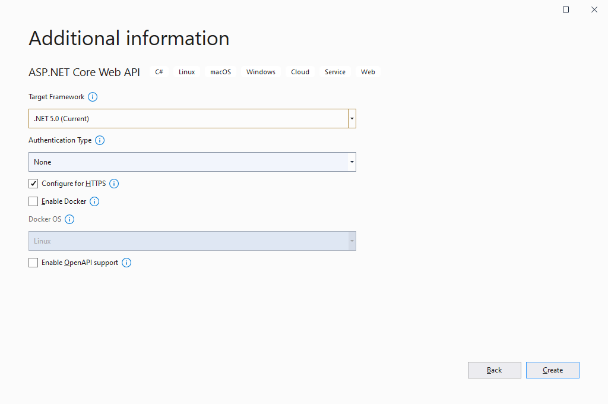

# Your First ASP.NET 5 Web API

## Create a new ASP.NET Core Web API solution and project

## Configure the Solution and API Project for Workshop

Solution name is **ChinookASPNETWebAPI**

Project name is **ChinookASPNETWebAPI.API**

## Set Details for the Solution and API Project

Target Framework is **.NET 5.0**

Authentication Type is **None**

Set Configure for HTTPS to **True**

Set Enable Docker to **False**

Set Enable OpenAPI support to **False**

## A View of the Solution and API Project

## Results when you run the API Project

**Note** -- I use a JSON Formatter in Chrome to make the Results look good.

## Delete the Existing Files in API Project

Delete the following files in API project:
* WeatherForcastController.cs
* WeatherForcast.cs

