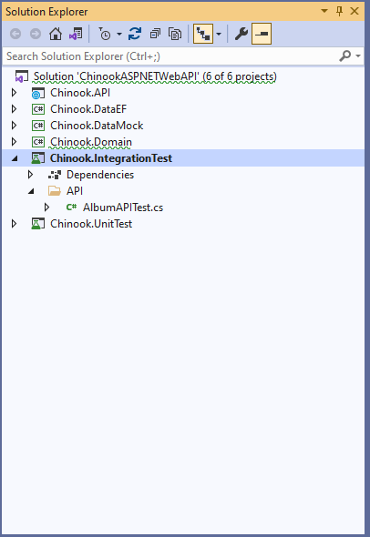
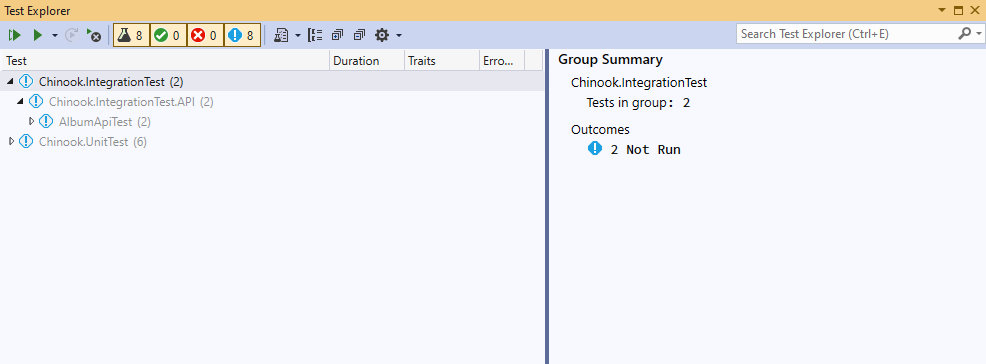
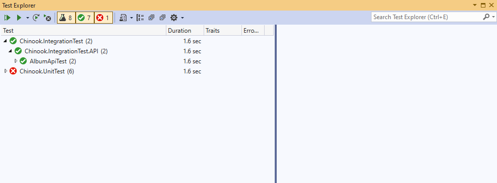

# Creating and using Integrating Testing for your API

## OPEN SOLUTION IN THE TESTING MODULE FOR INTEGRATION TESTING

\aspnet-5-web-api-workshop\module-2\02-02 Creating and using Integrating Testing for your Web API\testing

## EXPLORER THE ChinookASPNETWebAPI.IntegrationTest PROJECT AND UNDERSTAND THE TESTS

This will give you a good insight into how to create unit tests for different components of your Web API





## CREATE ADDITIONAL INTEGRATION TESTS

Using the existing integration tests for the Album as a guide, build more integration tests for some of the other models in the solution.

```csharp
[Theory]
[InlineData("GET")]
public async void AlbumGetAllTest(string method)
{
    // Arrange
    var request = new HttpRequestMessage(new HttpMethod(method), "/api/Album/");

    // Act
    var response = await _client.SendAsync(request);

    // Assert
    response.EnsureSuccessStatusCode();
    Assert.Equal(HttpStatusCode.OK, response.StatusCode);
}

[Theory]
[InlineData("GET", 1)]
public async Task AlbumGetTest(string method, int? id = null)
{
    // Arrange
    var request = new HttpRequestMessage(new HttpMethod(method), $"/api/Album/{id}");

    // Act
    var response = await _client.SendAsync(request);

    // Assert
    response.EnsureSuccessStatusCode();
    Assert.Equal(HttpStatusCode.OK, response.StatusCode);
}
```


## CHANGE YOUR COONECTIONSTRING TO MATCH ONE THAT CONNECTS TO CHINOOK DATABASE

Located in the appsettings.json file

```json
{
  "Logging": {
    "LogLevel": {
      "Default": "Information",
      "Microsoft": "Warning",
      "Microsoft.Hosting.Lifetime": "Information"
    }
  },
  "ConnectionStrings": {
    "ChinookDbWindows": "Server=.;Database=Chinook;Trusted_Connection=True;Application Name=ChinookASPNETCoreAPINTier",
    "ChinookDbDocker": "Server=localhost,1433;Database=Chinook;User=sa;Password=P@55w0rd;Trusted_Connection=False;Application Name=ChinookASPNETCoreAPINTier"
  },
  "AllowedHosts": "*"
}
```

## OPEN TEST EXPLORER AND BUILD TO SEE TESTS IN YOUR SOLUTION
Note -- You may need to rebuild your project for the Test Explorer to find the tests




## RUN TESTS



