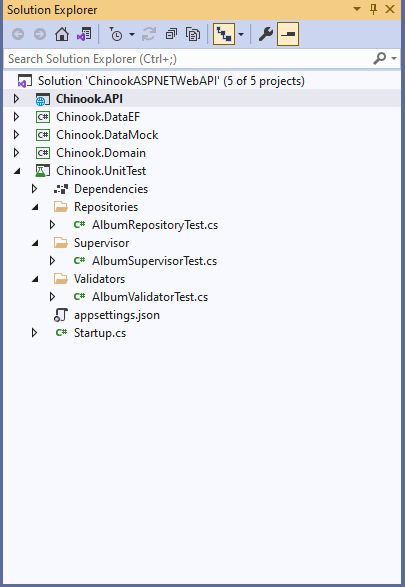
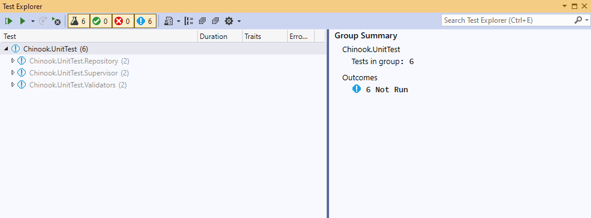
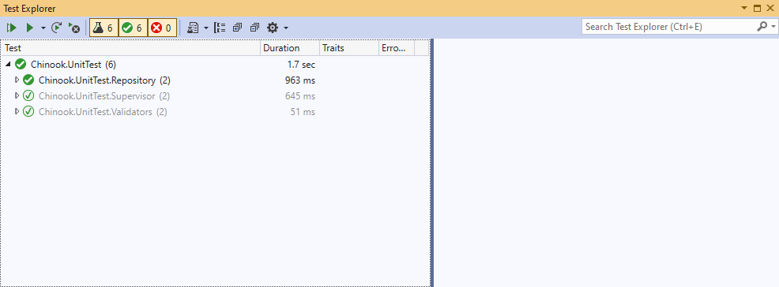

# Creating and using Unit Testing for your API

## OPEN SOLUTION IN THE TESTING MODULE FOR UNIT TESTING

\aspnet-5-web-api-workshop\module-2\02-01 Creating and using Unit Testing for your Web API\testing

## EXPLORER THE ChinookASPNETWebAPI.UnitTest PROJECT AND UNDERSTAND THE TESTS

This will give you a good insight into how to create unit tests for different components of your Web API





## CREATE ADDITIONAL UNIT TESTS FOR DATA REPOSITORIES

Using the existing tests for the Album and Artist Data Repositories as a guide, build unit tests for some of the other models in the solution.

```csharp
[Fact]
public async Task AlbumGetAll()
{
    // Arrange

    // Act
    var albums = await _repo.GetAll();

    // Assert
    Assert.True(albums.Count > 1, "The number of albums was not greater than 1");
}

[Fact]
public void AlbumGetOne()
{
    // Arrange
    var id = 1;

    // Act
    var album = _repo.GetById(id);

    // Assert
    Assert.Equal(id, album.Id);
}
```


## CREATE ADDITIONAL UNIT TESTS FOR SUPERVISOR

Using the existing tests for the Album and Artist Supervisor as a guide, build unit tests for some of the other models in the solution.

```csharp
[Fact]
public async Task GetAllAlbum_GivenTwoAlbumsInTheDatabase_ReturnsBoth()
{
    var album1 = new Album { Id = 12 };
    var album2 = new Album { Id = 123 };

    // Arrange
    _context.Albums.Add(album1);
    _context.Albums.Add(album2);
    _context.SaveChanges();

    // Act
    var albums = (await _super.GetAllAlbum()).ToList();

    // Assert
    albums.Count.Should().Be(2);
    albums.Should().Contain(x => x.Id == 12);
    albums.Should().Contain(x => x.Id == 123);
}

[Fact]
public void GetAlbumByID_MatchingAlbumInDB_ReturnsIt()
{
    // Arrange
    var albumId = 1;
    var artistId = 1234;

    // We are currently required to care about an Artist ID because the convert part of album specifically references the artist repository as well.
    _context.Artists.Add(new Artist() { Id = artistId });
    _context.Albums.Add(new Album() { Id = 1, ArtistId = 1234 });
    _context.SaveChanges();

    // Act
    var album = _super.GetAlbumById(albumId);

    // Assert
    album.Id.Should().Be(1);
}
```


## CREATE ADDITIONAL UNIT TESTS FOR VALIDATORS

Using the existing tests for the Album Validator as a guide, build unit tests for some of the other models in the solution.

```csharp
[Fact]
public void Should_have_error_when_Name_is_null()
{
    // Arrange
    var model = new AlbumApiModel { Title = null };
    
    // Act
    var result = _validator.TestValidate(model);

    // Assert
    result.ShouldHaveValidationErrorFor(album => album.Title);
}

[Fact]
public void Should_not_have_error_when_name_is_specified()
{
    // Arrange
    var model = new AlbumApiModel { Title = "Abbey Road" };
    
    // Act
    var result = _validator.TestValidate(model);

    // Assert
    result.ShouldNotHaveValidationErrorFor(album => album.Title);
}
```


## CHANGE YOUR COONECTIONSTRING TO MATCH ONE THAT CONNECTS TO CHINOOK DATABASE

Located in the appsettings.json file

```json
{
  "Logging": {
    "LogLevel": {
      "Default": "Information",
      "Microsoft": "Warning",
      "Microsoft.Hosting.Lifetime": "Information"
    }
  },
  "ConnectionStrings": {
    "ChinookDbWindows": "Server=.;Database=Chinook;Trusted_Connection=True;Application Name=ChinookASPNETCoreAPINTier",
    "ChinookDbDocker": "Server=localhost,1433;Database=Chinook;User=sa;Password=P@55w0rd;Trusted_Connection=False;Application Name=ChinookASPNETCoreAPINTier"
  },
  "AllowedHosts": "*"
}
```


## OPEN TEST EXPLORER AND BUILD TO SEE TESTS IN YOUR SOLUTION

Note -- You may need to rebuild your project for the Test Explorer to find the tests




## RUN TESTS



